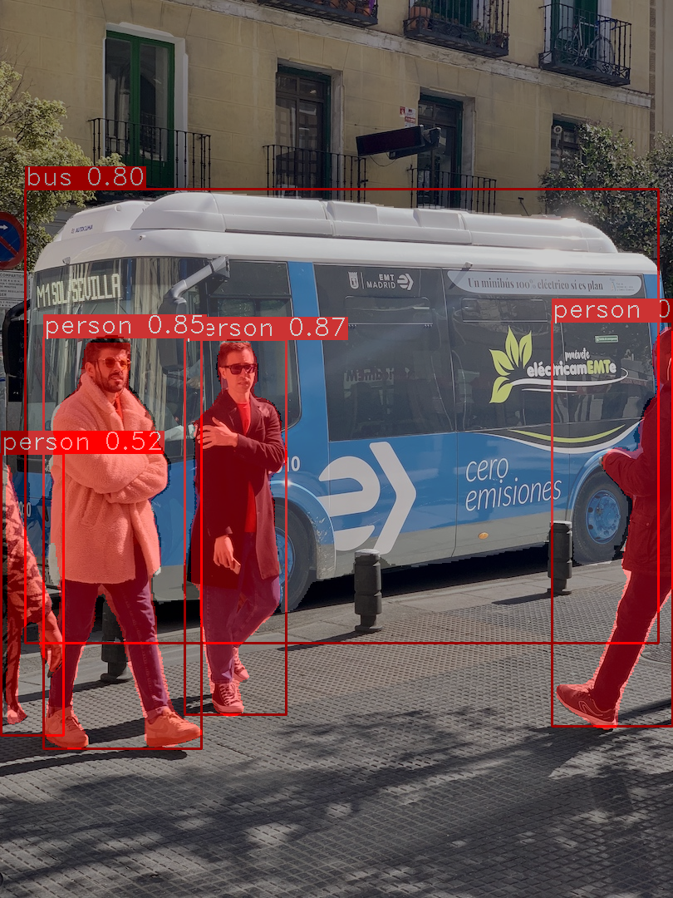
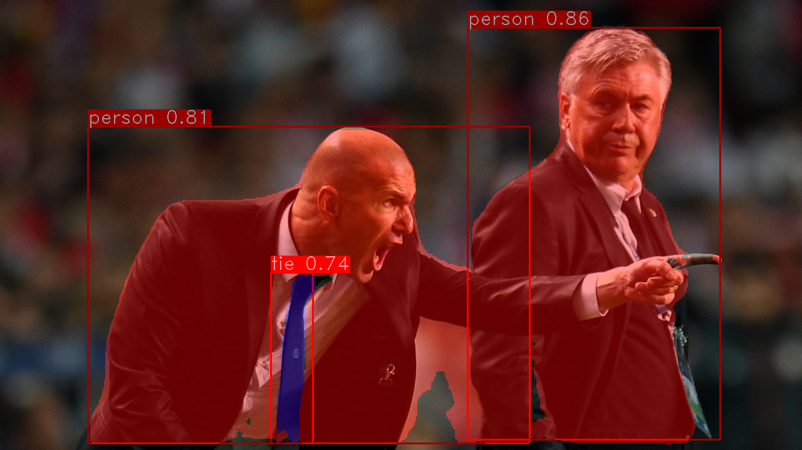

## Introduction

A LibTorch inference implementation of the [yolov5](https://github.com/ultralytics/yolov5) object detection and segmentation algorithm. Both GPU and CPU are supported.


## My Dependencies

- Ubuntu 20.04
- CUDA 11.3
- OpenCV 3.4.15
- LibTorch 1.12.0


## Setup

```bash
$ cd /path/to/libtorch-yolo5
# wget https://download.pytorch.org/libtorch/cu102/libtorch-cxx11-abi-shared-with-deps-1.6.0.zip
# unzip libtorch-cxx11-abi-shared-with-deps-1.6.0.zip
$ ./build.sh
```

To run inference on examples in the `./images` folder:

```bash
# CPU
$ ./libtorch-yolov5 --source ../images/bus.jpg --weights ../weights/yolov5s.torchscript.pt --view-img
# GPU
$ ./libtorch-yolov5 --source ../images/bus.jpg --weights ../weights/yolov5s.torchscript.pt --gpu --view-img
# Profiling
$ CUDA_LAUNCH_BLOCKING=1 ./libtorch-yolov5 --source ../images/bus.jpg --weights ../weights/yolov5s.torchscript.pt --gpu --view-img
```


## Demo







## References

1. https://github.com/ultralytics/yolov5
2. https://github.com/yasenh/libtorch-yolov5
